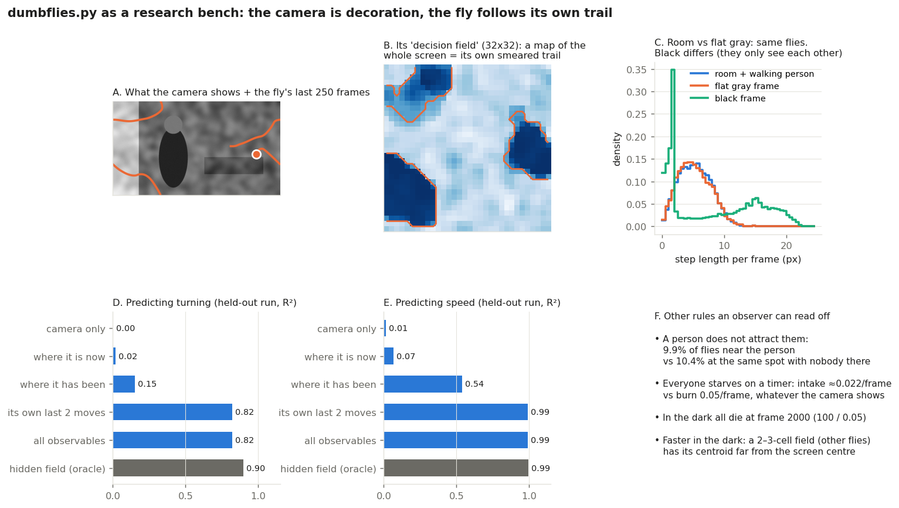
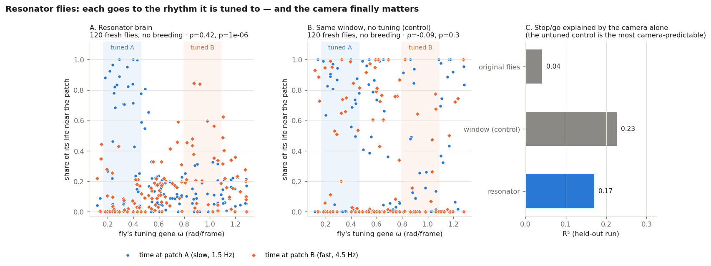
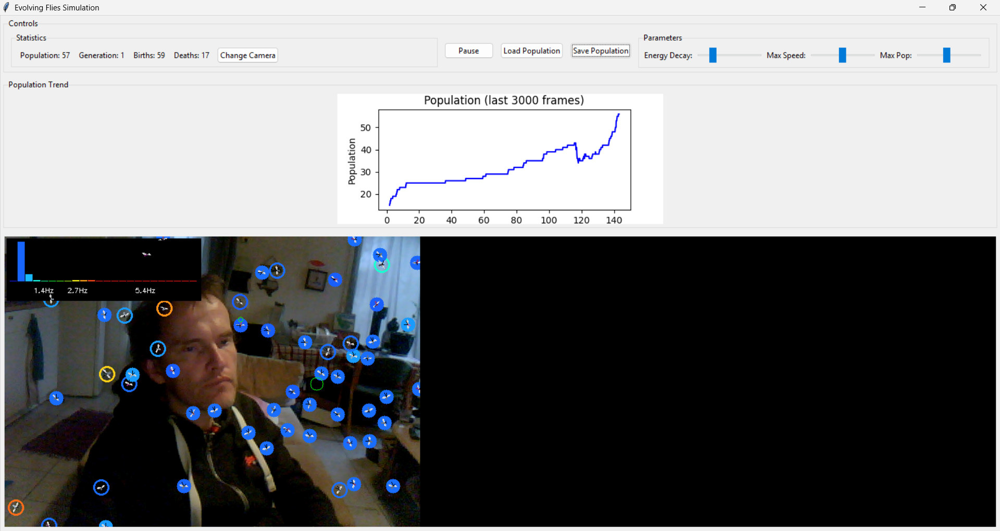
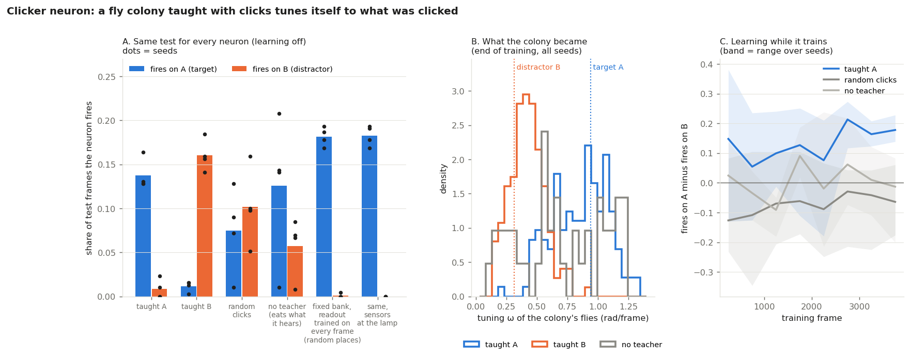

# FlyBench

EDIT: New HTML version live: 

[Check it out!](https://anttiluode.github.io/FlyBench/)

[Web version!](pic2.png)

*Left: resonator flies living on a webcam feed. Each ring's colour is the fly's tuning, the lines are the flies currently feeding the soma (bottom left), and the strip top left is the colony's tuning in Hz. Right: the arbor, a dendrite grown from the soma toward wherever the teacher's clicks fed flies, coloured by what they were tuned to.*

**PerceptionLab / Antti Luode, with Claude.** Do not hype. Do not lie. Just show.

FlyBench started from a question: why hadn't a year and a half of more sophisticated work beaten `dumbflies.py`, a webcam toy where evolving flies crawl over your room? The answer became a bench. The flies are a system whose rules are written down, so they are a black box with the answer key in the drawer. Watch them from the outside, then check what you concluded against the code.

It grew in four steps:

1. **Read the original flies.** The camera turned out to be decoration.
2. **Give them a real eye and a resonator brain.** Now each fly goes to the rhythm it is tuned to.
3. **Make a colony into a neuron you teach with clicks.** It tunes itself to what you clicked, and what it learned can be read off the colony.
4. **Compare the resonator unit with a transformer.** Below a few thousand data points it is 1,000× cheaper and as good or better; with lots of data the transformer wins.

---

## Quick start

```
pip install numpy scipy opencv-python scikit-learn matplotlib pillow
python clicker_neuron.py        # live: teach a neuron made of flies (webcam)
python resonator_flies.py       # live: resonator flies, no teacher
```

`dumbflies.py` must be in this folder or the one above, or set `DUMBFLIES=C:\path\to\dumbflies.py`. The original is never modified: every script loads its classes and swaps pieces at run time.

**Clicker neuron controls:**
- Left-click on the video (or press C) whenever the thing you want detected is happening: a phone blinking at a steady rate, a hand wave.
- A saves the arbor as a PNG, and R clears it.
- Save Population keeps a trained neuron.

If nobody clicks, the flies starve within a few minutes and are replaced by random ones, which is an untrained neuron. Every 10 seconds a row goes to `neuron_log.csv` (or `flies_log.csv` for `resonator_flies.py`); plot the latter with `python plot_log.py`.

---

## What held, what didn't

| claim | verdict |
|---|---|
| The original flies see the camera | **No.** The camera explains 0% of their turning. They steer by a smeared trail of where they have been. |
| Resonator flies go to the rhythm they're tuned to | **Yes.** ρ = 0.42, p = 1.5e-6, 120 flies with no breeding. The same brain without tuning shows no link (ρ = −0.09). |
| A resonator colony evolves toward the room's rhythms | **Supported, 2 seeds.** 44%→100% and 67%→98% in the rhythm room, 38%→35% with no rhythm. |
| Clicks teach a colony-neuron to fire on the clicked thing | **Yes, 4/4 seeds, and it reverses when you teach the other rhythm.** |
| What it learned can be read from the colony | **Yes.** The colony's median tuning lands near the taught rhythm. |
| The taught neuron ignores light switches | **No.** Open. |
| The neuron beats a standard learner | **No.** A fixed resonator bank with a readout trained on every frame wins (+0.18 against +0.13). |
| The resonator unit is cheaper than a transformer | **Below a few thousand points, yes** (as good or better at ~1/1000 the training cost). With plenty of data, no. |
| Growing the unit by selection helps | **Barely, and inconsistently.** |

---

## Part 1 — What the original flies are

`flybench.py` runs the original `BugConfig`, `ThinkingField` and `EnhancedBug` headless, with reproducible scenes instead of a webcam:
- `room`: a textured room with a bright window and a dark figure who walks in, sits and leaves.
- `room_static`: the same room, empty.
- `gray` and `black`: flat frames.

It logs what an observer could see (position, heading) and the hidden truth (energy, internal fields). Slow parts of the original were replaced with vectorised versions that are verified identical (max difference 2e-16; vision cone pixel-identical).

**What the code actually does.** A fly's "vision" is the whole frame masked to its cone and then shrunk to 32×32. So its fields are a map of the whole screen with a tiny stamp at the fly's position. Perception, memory and decision each smear that stamp, so the decision field becomes a blurred trail of where the fly has been, and the fly steers toward "trail centroid minus screen centre". Each frame is also normalised to its own brightest pixel, which erases brightness.

| test | result |
|---|---|
| Does the camera change movement? | **No.** Room, empty room and flat gray differ no more than two seeds of the same scene. An observer trained on flat gray predicts flies in the room just as well. |
| Does a walking person attract them? | **No.** 9.9% of flies near the person, against 10.4% at the same spot and frames with nobody there. |
| What feeds them? | Not their own motion, as predicted. Intake is ~0.02/frame whatever they do, against a burn of 0.05, so everyone starves on a timer. |
| In the dark? | They move *faster* (they only see each other) and all die at frame 2000 = 100 / 0.05. |

What an observer can predict (train on one seed, test on another, R²):

| features | turning | speed |
|---|---|---|
| camera only | 0.00 | 0.01 |
| where it is now | 0.02 | 0.07 |
| where it has been | 0.15 | 0.54 |
| its own last two moves | 0.82 | 0.99 |
| hidden field (oracle) | 0.90 | 0.99 |

Most of the predictability is inertia (momentum 0.5 in the code). Under it, history beats the present, and the camera explains nothing. The lesson for any "discover the rules" method: a flexible model scores 0.99 by learning inertia and tells you nothing about the mechanism; only the ablation found the trail.



```
python flybench.py room,gray,room_static,black 3000 0,1     # ~10 min on 2 cores
python analyze.py && python ablate.py && python fig.py
```

---

## Part 2 — Resonator flies

`resonator_brain.py` swaps only the brain. Body, movement, energy decay, mating and inheritance are the original code.

- **A real eye:** 9 points ahead of the fly (3 distances × 3 angles).
- **A windowed resonator on each eye point:** `z ← r·e^{iω}·z + (1−r)·d`. The tuning ω and the window r are genes.
- **Hop and listen.** Eyes are shut during a 10-frame hop. On landing the fly stands still, cancelling the body's own wander turn, and listens. It stays and eats while it hears its rate, otherwise it hops on. This was necessary: flying over plain texture registers *more* activity (9–12) than a mistuned flicker (4–7), so a fly that listened in flight could live on its own motion.
- **Control brain `window`:** the same eye, window and behaviour, but the unit measures flicker energy `e ← r·e + (1−r)·|d|` with no tuning. In your geometric-neuron terms, the resonator is S ⊕ A (decay plus rotation), and the control is S only.

Scene `rhythm`: the room plus two flickering patches, one at 0.05 and one at 0.15 cycles per frame.



| claim | test | verdict |
|---|---|---|
| Flies go to the rhythm they're tuned to | no breeding, 120 fresh random flies, 3 seeds | **Holds.** Tuned to the slow patch: 52% of life there, 7% at the other. Tuned to the fast one: 29% there, 14% at the other. ρ = 0.42, p = 1.5e-6. |
| It's the tuning, not the window | same test, control brain | **Holds.** The control sits at both patches (30–40% each) with no link to its tuning gene (ρ = −0.09, p = 0.31). |
| The camera now matters | predict stop/go from video only | **Holds.** Original flies 0.04, resonator 0.16, control 0.09 (R²). Turning is still ~0 for every brain. |
| The population evolves toward the room's rhythms | share of flies tuned to a rate present, start vs end | **Supported, 2 seeds.** 44%→100% and 67%→98% with rhythms; 38%→35% with none. The control (gene unused) drifted 38%→36% and 58%→82%. |
| Sorting with breeding | same, breeding on | Lineage-confounded (children are born next to their parents), so use the no-breeding test. |

> **Correction, Sep 28.** In the headless bench, the original `try_mate` builds children by looking up the name `EnhancedBug`, so the children of resonator and window flies got the *original* brain. `flybench.run` now points that name at the brain being run. The live launchers were never affected, and neither was the no-breeding test. All breeding runs were redone. This changed two published verdicts: evolution toward the rhythms went from "not shown" to "supported", and the control's camera score went from 0.23 to 0.09. A third result (camera plus tuning) was withdrawn. Numbers in `rescored_fixed.json`.

**Live notes (first runs, Sep 27–28):**
- **Light switch.** A light switch is a step, the slowest signal there is. With a fly held in place for 300 frames after lights-on, food was 40 for ω = 0.1, 15 for ω = 0.3, 6 for ω = 0.5, and under 2 for ω ≥ 0.8. In the dark it was zero at every tuning. The morning after the first overnight run, the colony went to 100 flies, all slow-tuned.
- **The morning population** (`python analyze_population.py pop.json 6.3`). Children are clones of one parent (the original's second `inherit_traits` call overwrites the first), so body size works as a family name. Two families owned all 106 flies, tuned 0.21 Hz and 0.27 Hz. Both winners sit in the bottom 15% of the random starting range, while their body sizes are unremarkable; if winning had nothing to do with tuning, that has a ~2% chance. It's one run.
- **Frame rate.** The original population graph replotted every point on every frame, so the loop slowed from ~12.5 to ~6 fps overnight, and a fly's tuning in Hz halves with it. Both launchers now keep the last 3000 points and redraw every 30 frames.
- **Canvas leak.** The original also created a new canvas image every frame and never removed the old ones. Both launchers now reuse one item per image.

```
python sort_nobreed.py                           # the key result, ~10 min
python flybench.py rhythm 6000 0,1 resonator     # also: window; and 'room 6000 0 resonator' as the no-rhythm control
python rescore_fixed.py && python res_fig.py
```

---

## Part 3 — Clicker neuron



One colony becomes one neuron. The flies are the dendrite: each listening fly is a tuned temporal filter sitting at a place. The soma sums what they hear, and your click is the modulator. `neuron.py`:

| part | rule | clock |
|---|---|---|
| weight | a fly's energy (÷100, clipped) | medium |
| soma | V = Σ weight × what it hears; fires when V > θ, and θ adapts so it fires ~10% of frames | fast |
| eligibility | a decaying trace of each fly's contribution, boosted when the soma fired | fast |
| click | food = 2 × eligibility, max 40 per fly and 120 per click. A click when nobody was listening feeds nobody | — |
| no click | a spike with no click within 30 frames costs 3 energy in total, split by contribution | — |
| anchoring | a fly fed by a click stays put for 400 frames even when it hears nothing, like a stabilised synapse | slow |
| growth | a fly over 130 energy buds: it splits in place and the copy's tuning mutates ±12%. No mating; unfed flies starve | slow |

Flies eat only what clicks give them. If `resonator_brain.py` is older than `neuron.py`, the launcher refuses to start; with the old file the flies would feed themselves and never need a click.

**Bench** (`neuron_bench.py`). The room has one lamp that always flickers, switching between a target rhythm A (0.15 cycles/frame) and a distractor B (0.05) in 120–240-frame segments, and the room light switches every 400–700 frames. The teacher clicks during A: about 65 clicks in 4000 frames. Every condition then gets the same 900-frame test with learning, decay and growth off. Four seeds per condition.



| claim | verdict |
|---|---|
| Clicks teach it to fire on the clicked thing | **Holds, 4/4 seeds.** Fires on A minus fires on B = +0.13 (+0.10 to +0.16): 14% on A, 0.8% on B. |
| It's the teaching, not the world | **Holds, 4/4 seeds, reversed.** Taught B instead: −0.15 (−0.13 to −0.18), 1% on A, 16% on B. |
| It's the click timing | **Holds.** The same number of clicks at random times gives −0.03, with mixed signs. |
| It beats no teacher | **Holds.** Flies eating what they hear give +0.07 (this world leans toward the faster flicker), and the colony shrinks to 5–14 flies, against 32–41 with a teacher. |
| What it learned can be read from the colony | **Holds.** Taught A: median tuning 0.90 (target 0.94), 47% of flies near A, 3% near B. Taught B: median 0.42, 65% near B (0.31), 1% near A. |
| It learns to ignore light switches | **No.** Taught neurons fire +0.14 more after a switch, the untaught one +0.18. Open. |
| It beats a standard learner | **No.** 40 fixed random resonators with a logistic readout trained on every frame's true label score +0.18, against the neuron's +0.13. The neuron gets ~65 clicks and only local rules. Its case is online learning from sparse clicks with a readable structure, not accuracy. |

**What failed on the way**, all on the same bench and seeds:
- **v0** used the original mating for growth. Fed flies rarely met, the colony starved to a few random refills, and it learned nothing.
- **v1** added budding. The colony was still only 1–2 flies at the lamp, because every distractor segment made the target-tuned flies hear nothing and hop away.
- **v2** added anchoring. The false-alarm cost was charged per spike to every contributor and ate most of the food.
- **v3** made that cost a fixed, shared 3 energy. This is the version in the table.

Raw runs are in `neuron_runs/`, with the failed versions in `neuron_runs_v0/` and `neuron_runs_v1/`.

**The arbor** (`arbor.py`, the right pane of the live app). A dendrite grows from the soma by space colonization (Runions et al. 2007; the same rule as GeometricNeuronAndSapolskysFractal). Every click drops resource where the flies it fed are sitting, coloured by their tuning. Tips grow toward resource near them, and resource nobody reaches fades after 900 frames. The tree only grows, so its shape records where, and on what rhythm, you taught. It is a visual record only and makes no computational claim; the question of grown geometry setting delays was the FunctionalArbor arc. It costs about 14 ms per frame at 4,600 segments.

```
python neuron_bench.py clicker,clicker_B,shuffled,no_credit 0,1,2,3    # ~40 min on 2 cores
python bank_control.py 0,1,2,3
python neuron_report.py
```

---

## Part 4 — Resonators against a transformer

`compare.py`, `compare2.py`. Each model forecasts 1 and 8 steps ahead and is scored on the last 20% of each series, never trained on. The score is MSE divided by the MSE of "same as last value", so lower is better. The models:
- **linear:** ridge regression on the last 32 values.
- **res:** 64 random resonators (the fly unit) with a ridge readout.
- **grown:** the same bank grown by selection, with no gradients.
- **transformer:** 2 layers, d = 32, window 32.

| task (training points) | linear | res | grown | transformer |
|---|---|---|---|---|
| sunspots, 1 step (~170) | 0.34 | **0.34** | 0.34 | 0.62 |
| sunspots, 8 steps | 0.26 | **0.24** | 0.30 | 0.89 |
| CO₂ weekly change, 1 step (~1,400) | 0.41 | 0.33 | **0.31** | 0.38 |
| recurring nonlinear regimes, 500, 1 step | 0.67 | 0.67 | **0.66** | 0.87 |
| recurring regimes, 2,000, 1 step | 0.58 | 0.55 | **0.55** | 0.58 |
| recurring regimes, 2,000, 8 steps | 0.49 | 0.38 | 0.37 | **0.35** |
| recurring regimes, 8,000, 1 step | 0.60 | 0.56 | 0.56 | **0.38** |
| recurring regimes, 8,000, 8 steps | 0.31 | 0.26 | 0.24 | **0.16** |

Cost: 258 parameters against 26,529; training takes 0.01–0.06 s against 10–320 s; each new sample in a stream costs 7 µs against 608 µs.

Below a few thousand points the resonator bank wins or ties at about 1/1000 of the training cost. With plenty of data and learnable nonlinear structure, the transformer wins; the crossover here was between 2,000 and 8,000 points. Growing the bank by selection adds little, inconsistently, at 30× the fitting time. The advantage comes from the resonator prior, and that prior is known: `z ← r·e^{iω}·z + x` is one mode of a diagonal linear state-space model (LRU, S4D).

---

## Files

| file | what |
|---|---|
| `flybench.py` | headless bench: loads the original classes, synthetic scenes, logs observables and hidden truth |
| `analyze.py`, `ablate.py`, `fig.py` | Part 1 observers, ablation, figure |
| `resonator_brain.py` | the resonator and window brains |
| `resonator_flies.py` | live webcam flies with the resonator brain; logs `flies_log.csv` |
| `sort_nobreed.py`, `res_eval.py`, `rescore_fixed.py`, `res_fig.py` | Part 2 tests and figure |
| `neuron.py` | the clicker neuron: soma, eligibility, clicks, anchoring, budding |
| `clicker_neuron.py` | live webcam clicker neuron with the arbor; logs `neuron_log.csv` |
| `arbor.py` | the growing dendrite |
| `neuron_bench.py`, `bank_control.py`, `neuron_report.py` | Part 3 bench, the standard-learner control, figure |
| `compare.py`, `compare2.py` | Part 4 |
| `analyze_population.py` | read a saved population: families, tunings, ages |
| `plot_log.py` | plot `flies_log.csv` |
| `diag_neuron.py`, `diag2.py` | the diagnostics that found why v1 and v2 failed |

The live launchers were tested here with a stubbed GUI; they were run on a real webcam only by Antti (the picture at the top).
